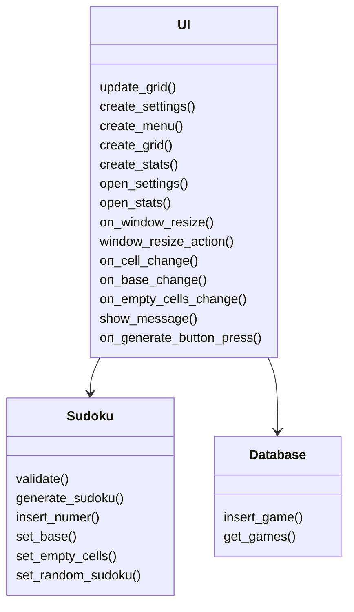
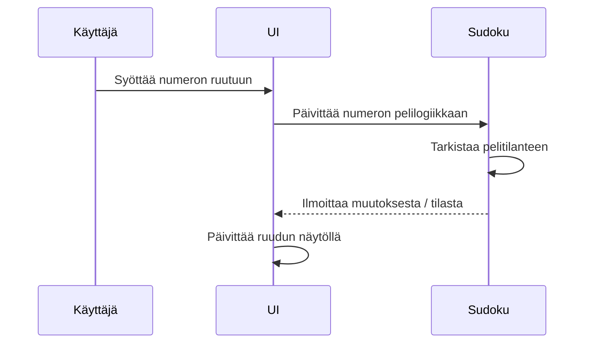
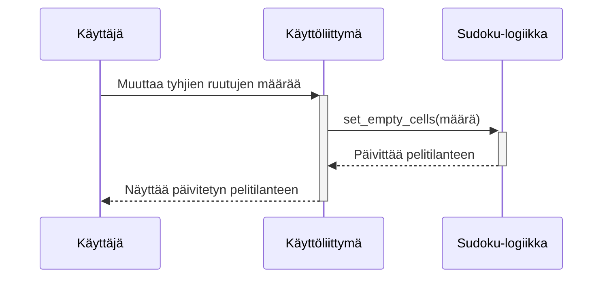
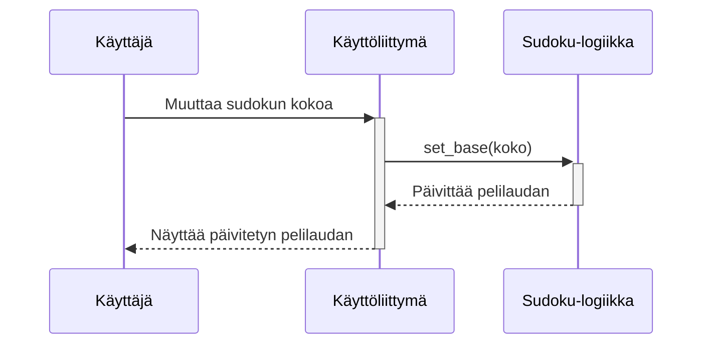

# Arkkitehtuuri

## Rakenne

Sudoku-projektin pääkomponentit jaetaan seuraaviin luokkiin:  

- **UI**: Sisältää käyttöliittymäkomponentit ja käyttäjän kanssa vuorovaikutuksen hallinnan.
- **Sudoku**: Vastaa pelilogiikan toteutuksesta, kuten pelitilanteen ylläpidosta ja sääntöjen validoinnista.  
- **Database**: Vastaa pelien tallentamisesta ja hakemisesta SQLite-tietokannan avulla.

Jokainen luokka on suunniteltu siten, että ne toimivat itsenäisesti, mahdollistaen modulaarisen kehityksen ja ylläpidon.

## Käyttöliittymä
Käyttöliittymä koostuu seuraavista näkymistä:  

- **Pelin aloitusnäkymä**: Mahdollistaa pelin pelaamisen, uuden Sudokun generoinnin sekä asetukset- ja tilastot-ikkunan avaamisen.
- **Peliruudukko**: Näyttää aktiivisen Sudoku-pelitilanteen ja sallii numeroiden syöttämisen.
- **Ratkaisun palautteenanto**: Ikkuna, joka imoittaa pelin lopputuloksesta tai virheellisistä siirroista.
- **Asetukset**: Mahdollistaa tyhjien ruutujen määrän sekä Sudokun koon muuttamisen.
- **Tilastot**: Näyttää taulukkomuodossa pelin keston, siirtojen määrän ja tyhjien ruutujen määrän pelaajan aikaisemmista peleistä.  

Käyttöliittymä on toteutettu käyttäen Tkinter-kirjastoa, ja se pyrkii erottamaan käyttöliittymän logiikan selkeästi sovelluslogiikasta. Käyttöliittymä kutsuu Sudoku-luokan metodeja pelitilanteen päivittämiseksi ja validoinniksi sekä Database-luokan metodeja, kun pelitietoja halutaan tallentaa tietokantaan tai hakea tietokannasta.

## Sovelluslogiikka
Sovelluslogiikan muodostaa Sudoku-luokka, joka hallinnoi pelin tilaa ja sääntöjen noudattamista. Luokka tarjoaa metodit kuten:  

- **generate_sudoku()**: Luo satunnaisen Sudokun.
- **validate()**: Tarkistaa, onko koko peliruudukko täytetty oikein.
- **set_empty_cells()**: Asettaa Sudokuun halutun määrän tyhjiä ruutuja.
- **set_base()**: Muuttaa Sudokun kokoa.

## Tietojen pysyväistallennus
Database-luokka vastaa tietokantayhteyksien hallinnasta ja tietojen tallentamisesta sekä hakemisesta sqlite-tietokannasta. Luokka huolehtii Sudoku-pelien tilastotietojen, kuten peliajan, siirtojen määrän ja tyhjien ruutujen lukumäärän, tallentamisesta.

- **Tietokannan alustus**: Sovelluksen käynnistyessä Database-luokan konstruktori luo yhteyden sqlite-tietokantaan. Se myös varmistaa, että tarvittava taulu pelitietojen tallentamiseen on olemassa.
- **Pelitietojen tallennus**: insert_game-metodi tallentaa pelin tiedot tietokantaan. Metodi ottaa vastaan pelin aloitusaikaleiman, siirtojen määrän ja tyhjien ruutujen lukumäärän, ja tallentaa nämä tiedot tietokantaan.
- **Pelitietojen haku**: get_games-metodi hakee kaikki pelitilastot tietokannasta ja palauttaa ne listana.

### Käyttöliittymän ja tietokannan integraatio
Käyttöliittymä vastaa käyttäjän toimintojen käsittelystä ja näyttää pelitilastot käyttäjälle. Se käyttää Database-luokkaa pelitietojen tallentamiseen ja hakemiseen. Esimerkiksi, kun käyttäjä päättää pelin, UI kutsuu Database-luokan insert_game-metodia tallentaakseen pelitilastot.

## Päätoiminnallisuudet
Kuvataan sovelluksen keskeiset toiminnallisuudet sekvenssikaaviona:

### Uuden numeron lisääminen ruutuun
Kun käyttäjä lisää numeron Sudokun ruutuun, sovelluksen kontrolli etenee seuraavasti:  

### Tyhjien ruutujen lukumäärän muuttaminen
Kun käyttäjä muuttaa Sudokussa olevien tyhjien ruutujen lukumäärää, sovelluksen kontrolli etenee seuraavasti:  

### Sudokun koon muuttaminen
Kun käyttäjä muuttaa Sudokun kokoa, sovelluksen kontrolli etenee seuraavasti:  

