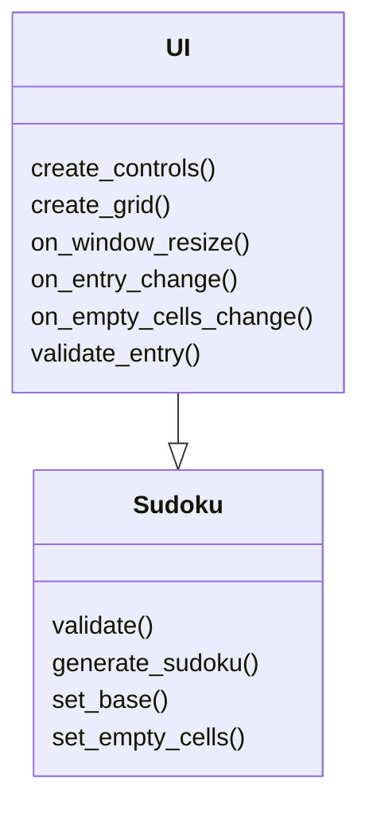
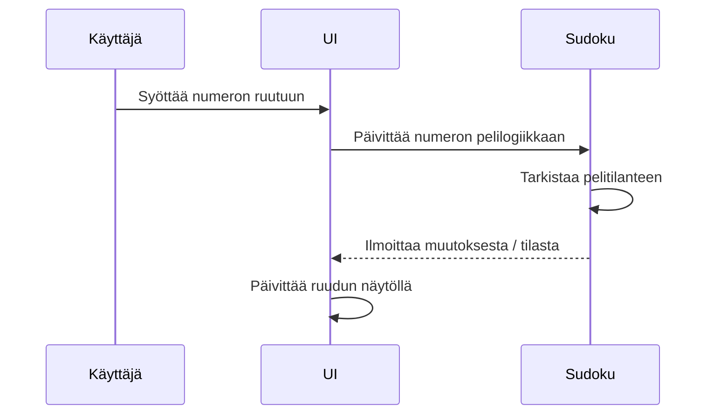

# Arkkitehtuurikuvaus

## Rakenne

Sudoku-projektin arkkitehtuuri perustuu kolmitasoiseen kerrosarkkitehtuuriin. Ohjelman pääkomponentit jaetaan seuraaviin pakkauksiin:  

- UI: Sisältää käyttöliittymäkomponentit ja käyttäjän kanssa vuorovaikutuksen hallinnan.
- Sudoku: Vastaa pelilogiikan toteutuksesta, kuten pelitilanteen ylläpidosta ja sääntöjen validoinnista.  

Jokainen pakkaus on suunniteltu siten, että ne toimivat itsenäisesti, mahdollistaen modulaarisen kehityksen ja ylläpidon.

### Käyttöliittymä
Sudoku-käyttöliittymä koostuu seuraavista näkymistä:  

- Pelin aloitusnäkymä: Mahdollistaa uuden pelin aloittamisen ja peliasetusten määrittelyn.
- Peliruudukko: Näyttää aktiivisen Sudoku-pelitilanteen ja sallii numeroiden syöttämisen.
- Pelitilanteen palautteenanto: Ilmoittaa pelin lopputuloksesta tai virheellisistä siirroista.
- Käyttöliittymä on toteutettu käyttäen Tkinter-kirjastoa, ja se pyrkii erottamaan käyttöliittymän logiikan selkeästi sovelluslogiikasta. Käyttöliittymä kutsuu Sudoku-pakkauksen metodeja pelitilanteen päivittämiseksi ja validoinniksi.

### Sovelluslogiikka
Sovelluslogiikan muodostaa Sudoku-luokka, joka hallinnoi pelin tilaa ja sääntöjen noudattamista. Luokka tarjoaa metodit kuten:  

- initialize_game(): Alustaa uuden pelin asetetulla vaikeustasolla.
- update_cell(row, col, value): Päivittää solun arvon ja tarkistaa sääntöjenmukaisuuden.
- check_solution(): Tarkistaa, onko koko peliruudukko täytetty oikein.
- Sudoku-luokka käyttää apuna Helpers-pakkauksen funktioita, kuten ruudukon generointia ja tarkistuslogiikkaa.

## Tietojen pysyväistallennus
Sovellus ei tässä vaiheessa sisällä tietojen pysyväistallennusta, mutta arkkitehtuuri on suunniteltu tukemaan laajennuksia, kuten pelaajien tilastojen tallennusta tai pelitilanteiden tallentamista myöhempää jatkamista varten.

## Päätoiminnallisuudet
Kuvataan sovelluksen keskeiset toiminnallisuudet sekvenssikaaviona:

### Uuden numeron lisääminen ruutuun
Kun käyttäjä lisää numeron Sudokun ruutuun, sovelluksen kontrolli etenee seuraavasti:  

