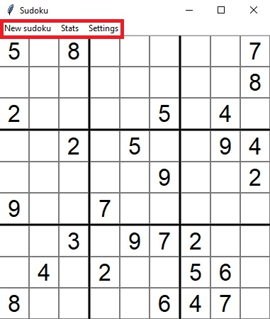
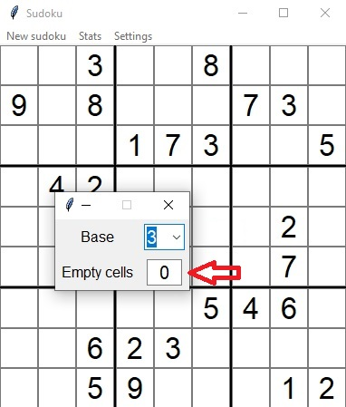
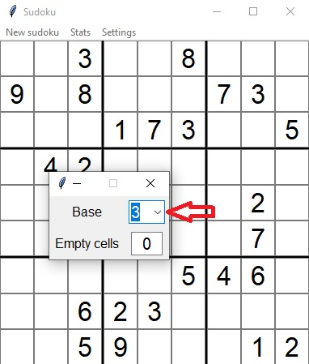
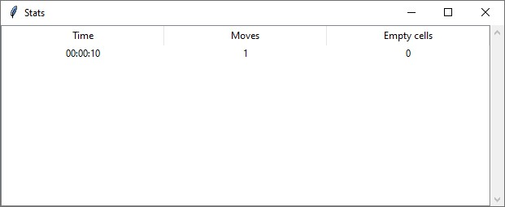

# Käyttöohje

Ohjelma on hyvin simppeli ja sen kaikki toiminnot selviävät kokeilemalla muutamassa sekunnissa. Pidän siksi käyttöohjeen lyhyenä.

## Ohjelman käynnistäminen

1. Asenna riippuvuudet komennolla:

```bash
poetry install
```

2. Käynnistä ohjelma komennolla:

```bash
poetry run invoke start
```

## Uuden pelin aloittaminen

Kun ohjelma on käynnistetty, se luo automaattisesti satunnaisen Sudokun, jonka käyttäjä voi ratkaista.

## Uuden Sudokun generointi

Uuden satunnaisen Sudokun generointi onnistuu helposti valikosta painamalla "New Sudoku"-tekstiä. Valikosta saa myös avattua asetukset ja pelien tilastot.



## Asetukset

### Tyhjien ruutujen lukumäärä

Tyhjien ruutujen lukumäärä voi olla nollan ja Sudokun ruutujen määrän välillä oleva numero.



### Sudokun koko

Sudokun koon voi valita dropdown-valikosta. Base 3 tarkoittaa, että Sudokun sivu on 3 * 3 = 9 ruutua pitkä. Base 4 taas tarkoittaa, että Sudokun sivu on 4 * 4 = 16 ruutua pitkä.



## Pelin tarkistus

Sudoku tarkistetaan automaattisesti, kun kaikki ruudut ovat täynnä.

## Statistiikka

Statistiikka-ikkunasta näkee tilastoja aikaisemmista peleistä.

