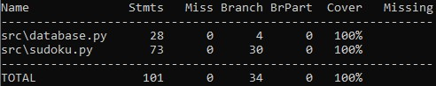

# Testausdokumentti

Sovellusta on testattu Pytestin avullla yksikkö- ja integraatiotesteillä sekä manuaalisesti käymällä läpi ohjelma läpikotaisesti ja yrittämällä syöttää tekstikenttiin virheellisiä arvoja.

## Yksikkö- ja integraatiotestit

### Tietokanta (database.py)

TestDatabase-luokka sisältää yksikkötestejä Database-luokalle. Testeissä luodaan testausta varten uusi tietokantatiedosto "testing.db". Testeissä testataan kahta Database-luokan tarjoamaa metodia, joiden avulla voi joko lisätä tietokantaan pelitietoja tai hakea niitä tietokannasta.

### Sudoku (sudoku.py)

TestSudoku-luokka sisältää yksikkötestejä Sudoku-luokalle. Testit keskittyvät muun muassa:

- solujen validiuden tarkistamiseen
- pelilaudan oikeellisuuden varmistamiseen.

### Testikattavuus

Testikattavuus on testattu Coverage-kirjaston avulla. Testauksen haaraumakattavuus on 100%, mutta tämän perusteella ei pitäisi kuitenkaan olettaa, että testit ovat täydellisiä.
 
 

## Järjestelmätestaus

Järjestelmätestaus on suoritettu kattavasti käyttöohjeiden kuvaamalla tavalla sekä Linux- että Windows-ympäristössä. Järjestelmätestauksen aikana on kiinnitetty erityistä huomiota syötekenttien virheidenkäsittelyyn. Kaikkiin syötekenttiin on yritetty syöttää virheellisiä arvoja, ja järjestelmän on varmistettu käsittelevän nämä tapaukset asianmukaisesti.