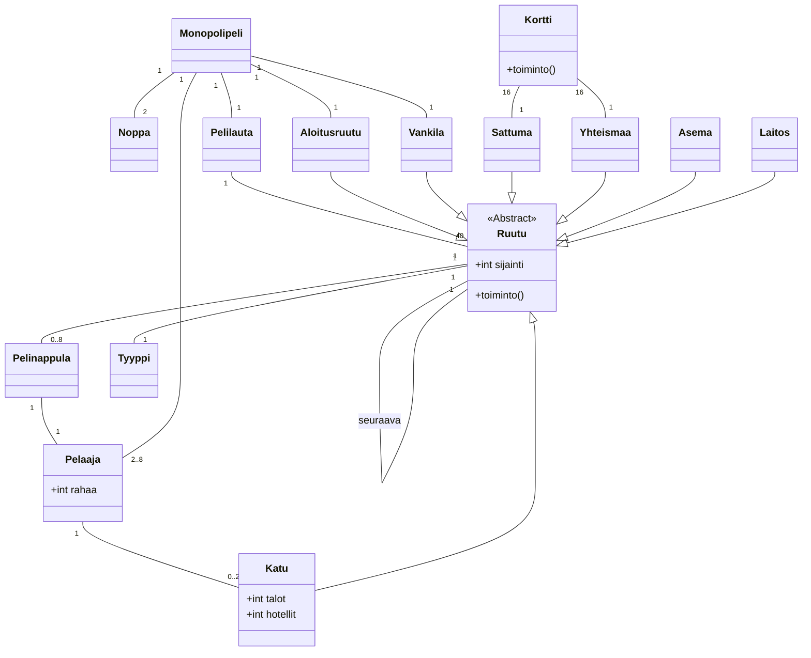

```mermaid
classDiagram
    Monopolipeli "1" -- "2" Noppa
    Monopolipeli "1" -- "1" Pelilauta
    Pelilauta "1" -- "40" Ruutu
    Ruutu "1" -- "1" Ruutu : seuraava
    Ruutu "1" -- "0..8" Pelinappula
    Ruutu "1" -- "1" Tyyppi
    Aloitusruutu --|> Ruutu
    Vankila --|> Ruutu
    Sattuma --|> Ruutu
    Yhteismaa --|> Ruutu
    Asema --|> Ruutu
    Laitos --|> Ruutu
    Katu --|> Ruutu
    Monopolipeli "1" -- "1" Aloitusruutu
    Monopolipeli "1" -- "1" Vankila
    Pelinappula "1" -- "1" Pelaaja
    Pelaaja "2..8" -- "1" Monopolipeli
    Kortti "16" -- "1" Sattuma
    Kortti "16" -- "1" Yhteismaa
    Pelaaja "1" -- "0..22" Katu
    <<Abstract>> Ruutu
    class Ruutu {
        +int sijainti
        +toiminto()
    }
    class Kortti {
        +toiminto()
    }
    class Pelaaja {
        +int rahaa
    }
    class Katu {
        +int talot
        +int hotellit
    }
```